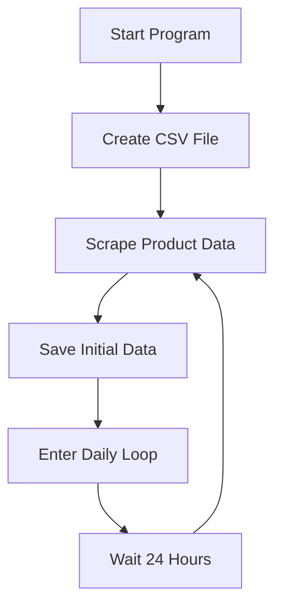

# TrackZon


A Python script that automatically tracks and records Amazon product prices at regular intervals, saving the data to a CSV file for price monitoring and analysis.

## Features

- 🛒 Scrapes product title and price from Amazon product pages
- 📊 Stores historical price data in CSV format
- ⏰ Automatically updates prices daily (configurable interval)
- 📅 Timestamps each price entry with current date/time
- 🖥️ Easy desktop file storage

## How It Works

The script performs the following steps:
1. Sends HTTP requests to Amazon using browser-like headers
2. Parses HTML response to extract product information
3. Combines price components into a single value
4. Creates a CSV file if none exists
5. Appends new price entries at scheduled intervals
6. Runs continuously with daily price checks



## Installation

1. Clone the repository:
```bash
git clone https://github.com/yourusername/amazon-price-tracker.git
cd amazon-price-tracker
```

2. Install required packages:
```bash
pip install -r requirements.txt
```

## Configuration

Edit the following variables in the script:
```python
# Replace with your target product URL
url = "https://www.amazon.com/YOUR-PRODUCT-PATH"

# Update with your desktop path
CSV_PATH = "C:/Users/yourusername/Desktop/AmazonWebScraperDataset.csv"
```

## Usage

Run the script:
```bash
python AmazonWebScraperTool.py
```

The program will:
1. Create a CSV file on your desktop
2. Add the current price as the first entry
3. Continue adding new entries every 24 hours

To stop the program, press `Ctrl+C` in your terminal.

## Output Example

The CSV file will contain:

Title | Price | Date
------|-------|-----
adidas Men's Falcon Sneaker | 42.99 | 2023-08-15 14:30:45
adidas Men's Falcon Sneaker | 41.99 | 2023-08-16 14:31:22
adidas Men's Falcon Sneaker | 44.99 | 2023-08-17 14:32:10

## Customization

- **Change scraping interval**: Modify the sleep duration in seconds:
```python
time.sleep(86400)  # Current 24-hour interval
```

- **Add proxy support**: Insert before the request:
```python
proxies = {
    'http': 'http://your-proxy-ip:port',
    'https': 'http://your-proxy-ip:port'
}
response = requests.get(url, headers=headers, proxies=proxies)
```

## Limitations

- Amazon may block frequent requests
- Requires manual URL and path configuration